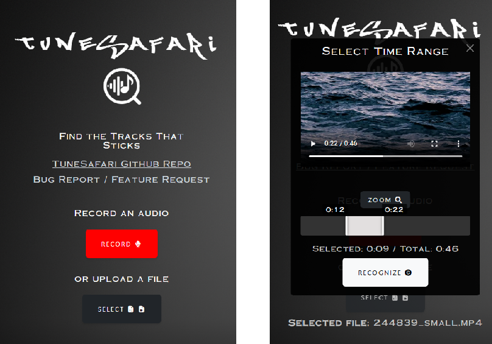

# TuneSafari
TuneSafari is a scalable music fingerprinting and recognition system featuring multi-processing, multi-instance support, memory caching, media trimming and API integration.

This project is under development, core algorithm based on [worldveil/dejavu](https://github.com/worldveil/dejavu), which is licensed under the MIT License.

## Features

- **Multi-processing**: Enables faster processing times by distributing requests across multiple processing threads or cores and multiple database instances.

- **Result Storage Support**: Supports storing processed results in databases for easy retrieval, analysis, and re-use.

- **Redis Caching**: Utilizes Redis for caching frequently queried audio fingerprints to improve response time and reduce database load.

- **High Performance Database Support**: Supports **ClickHouse** for rapid queries and high-speed data handling for large-scale deployments.

- **Multi Database Instance Support**: A scalable design that enables seamless integration of multiple databases, allowing the recognition engine and result storage to independently scale and handle large volumes of data efficiently across various databases.

- **Resilient Database Instance Handling**: Utilizing the remaining available database instances in the event that some configured database instances are temporaily down or unreachable. **WARNING**: It is not recommended to keep permanently removed or offline database instances in the configuration file, as this may lead to downgraded performance due to continuous retry attempts.

- **Universal Multimedia Format Support**: Automatically converts submitted audio or video data to a standardized WAV format [44.1 kHz (configurable via `DEFAULT_FS`), 16-bit] before processing to handle a wide range of multimedia formats.

- **Media Trimming**: Supports recognizing selected portions of the submitted media file.

- **REST API**: Allows audio data recognition and fingerprinting through URL submission.

- **Rate Limiting**: Configurable settings to manage the rate of incoming requests for recognizing, fetching results and fingerprinting independently.

- **Token authentication and write protection for audio fingerprinting requests**: Ensures that only authorized users can add audio fingerprint data to the database, with built-in write protection to maintain data integrity.

## Documentation & Deployment

This project is composed of three main components: **TuneSafari_api**, **TuneSafari_ui**, and **TuneSafari_uploader**. Below you will find a brief overview of each part, with links to their respective detailed documentation.

### [TuneSafari_api](./tunesafari_api/README.md)

The backend API for handling music recognition, result storage and audio fingerprinting. Built with Python/Flask.

### [TuneSafari_ui](./tunesafari_ui/README.md)

The web application serving as the user interface (UI) for the project. Built with Next.js/React.

### [TuneSafari_uploader](https://bboymega.github.io/TuneSafari/)

The TuneSafari Uploader is a lightweight web interface for uploading audio files to the TuneSafari backend to generate audio fingerprints for future recognition. It interacts directly with the `/api/fingerprint` API endpoint.

You can deploy the uploader on your own server, or use the hosted version available [here](https://bboymega.github.io/TuneSafari/).

All credentials are stored locally in your browser. No credentials are stored on the hosted server.